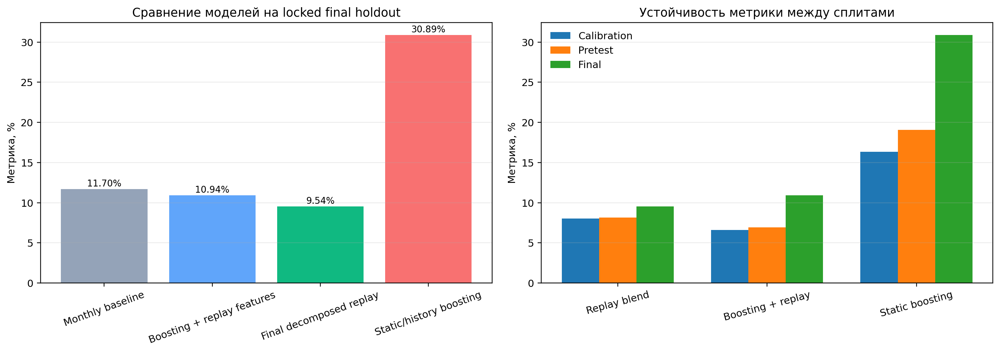
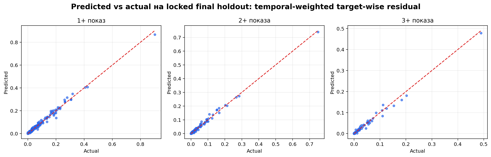

# VK Ads Reach & Frequency Forecasting

Leak-free forecasting pipeline for predicting future advertising reach and frequency in an auction-based ad system.

The project predicts the share of a campaign audience that will see an ad at least once, twice, and three times:

- `at_least_one`: share of users with 1+ impressions;
- `at_least_two`: share of users with 2+ impressions;
- `at_least_three`: share of users with 3+ impressions.

The final solution combines auction/session replay, temporal blending, and a regularized residual calibration layer. The best locked temporal holdout score is **9.29%**; lower is better.

---

## Project Highlights

| Component | Summary |
|---|---|
| Task | Forecast threshold reach: `P(N>=1)`, `P(N>=2)`, `P(N>=3)` for future ad campaigns |
| Domain | Auction-based online advertising, VK Ads-like impression logs |
| Final model | **Temporal-weighted target-wise Ridge residual** over decomposed replay |
| Final score | **9.29%** on locked temporal holdout |
| Main baseline | Monthly replay: **11.70%** |
| Strong replay baseline | Base decomposed replay: **9.54%** |
| ML baselines | Boosting with replay features: **10.94%**; AdVance-inspired MLP: **9.52%** |
| Validation | Strict temporal split, past-only features, model lock, leakage tests |

---

## Why This Problem Matters

Advertisers need to estimate campaign performance before launch: how many users will be reached, how often they will see the ad, and whether a chosen CPM is enough for the planned audience and placements.

In an auction-based ad system, this is not a plain regression problem. Impressions depend on:

- campaign CPM and competition for each ad opportunity;
- available inventory over time;
- publisher mix;
- user activity and sessions;
- frequency restrictions inside a user session.

The practical value of this model is that it can be used for:

- reach/frequency planning before campaign launch;
- scenario analysis for different CPM values, publishers, and time windows;
- budget and bidding decision support;
- frequency control diagnostics;
- a first layer for downstream click, conversion, and cost forecasting.

---

## Data

Raw dataset files are not included in the repository. Place them locally and set `VK_ADS_DATA_DIR` before running the code.

| File | Description | Size |
|---|---|---:|
| `users.tsv` | user attributes: sex, age, city | 27,769 users |
| `history.tsv` | historical impressions: hour, CPM, publisher, user | 1,147,857 impressions |
| `validate.tsv` | future campaign configurations | 1,008 campaigns |
| `validate_answers.tsv` | ground-truth shares for 1+/2+/3+ impressions | 1,008 rows |

Additional dataset facts:

- historical logs cover 1,488 hours, approximately 62 days;
- 25,536 users appear in historical impressions;
- there are 21 publishers;
- validation campaign audience size ranges from 300 to 2,500 users, with median 960.

The public dataset contains only limited auction logs: user, hour, publisher, and winning CPM. It does not include losing bids, candidate ads, creatives, clicks, conversions, budgets, or a full auction graph. This is why the solution uses a replay-based approximation instead of a full production auction model.

---

## Method Overview

The final model is a modular pipeline rather than a black-box end-to-end model.

1. **Campaign input**  
   Reads CPM, time window, publishers, audience size, and target user IDs.

2. **Past-only history**  
   Uses only historical impressions available before the forecast cutoff.

3. **Auction replay**  
   Replays a future campaign on historical ad opportunities by comparing campaign CPM with historical winning CPM:

   - `P(win)=1` if `cpm_campaign > cpm_history`;
   - `P(win)=0.5` if `cpm_campaign = cpm_history`;
   - `P(win)=0` if `cpm_campaign < cpm_history`.

4. **Sessionization**  
   Applies the 6-hour session rule so repeated impressions inside one user session are not overcounted.

5. **User-level frequency aggregation**  
   Estimates `P(N>=1)`, `P(N>=2)`, and `P(N>=3)` for each user.

6. **Audience aggregation**  
   Averages user-level probabilities over the campaign audience.

7. **Temporal blend**  
   Combines monthly, daily, and weekly replay components in log-space.

8. **Residual calibration**  
   Applies target-wise Ridge residual correction with recency weighting and bounded correction.

<p align="center">
  
</p>

---

## Metric

The official metric is a smoothed mean log-ratio error over all validation campaigns and all three targets:

$$
Score =
100\% \cdot
\left(
\exp\left(
\frac{1}{3n}
\sum_{i=1}^{n}
\sum_{j=1}^{3}
\left|
\log
\frac{\hat y_{ij}+\varepsilon}{y_{ij}+\varepsilon}
\right|
\right)-1
\right),
\quad \varepsilon=0.005.
$$

Lower is better.

This metric is well aligned with the task because it evaluates relative error for small probability-like shares and jointly accounts for all three frequency thresholds.

---

## Results

The final model improves both simple historical baselines and stronger ML baselines.

| Model | Final holdout ↓ | Improvement vs monthly ↑ |
|---|---:|---:|
| Monthly baseline | 11.70% | 0.0% |
| Boosting + replay features | 10.94% | +6.5% |
| Base decomposed replay | 9.54% | +18.5% |
| Target-wise Ridge residual | 9.46% | +19.1% |
| **Temporal-weighted target-wise Ridge residual** | **9.29%** | **+20.6%** |
| Static/history boosting | 30.89% | -164.0% |

<p align="center">
  
</p>

The final predictions are also close to average target values on the locked final holdout:

| Target | Actual | Predicted | Relative difference |
|---|---:|---:|---:|
| 1+ | 0.0653 | 0.0677 | +3.7% |
| 2+ | 0.0258 | 0.0263 | +1.9% |
| 3+ | 0.0138 | 0.0134 | -2.9% |

<p align="center">
  
</p>

---

## Experiment Summary

The project includes several families of experiments:

| Experiment family | Purpose | Best / representative result |
|---|---|---:|
| Monthly replay | simple historical baseline | 11.70% final |
| Daily / weekly / geometric replay | past-only temporal replay variants | 9.54% final for base decomposed replay |
| Boosting baselines | ML baseline over aggregate and replay features | 10.94% final with replay features |
| Segment residual calibration | segment-aware correction over replay | 9.51% final |
| Ridge residual | regularized residual correction | 9.47% final |
| Target-wise Ridge residual | separate residual heads for 1+/2+/3+ | 9.46% final |
| Probabilistic exposure simulator | user-level activity and hazard simulation | 9.54% final |
| Hazard-feature residual | simulator diagnostics as residual features | 9.47% final |
| AdVance-inspired MLP | neural multi-task residual baseline | 9.52% final |
| Temporal-weighted residual | recency-weighted residual calibration | 9.47% final |
| **Temporal-weighted target-wise residual** | final model | **9.29% final** |

Full hyperparameter and experiment table:

- [`reports/experiments_hyperparameters_table.md`](reports/experiments_hyperparameters_table.md)
- [`reports/experiments_hyperparameters_table.csv`](reports/experiments_hyperparameters_table.csv)

---

## Leakage Control

The most important engineering constraint is avoiding future information leakage.

The validation protocol uses complete temporal groups:

| Zone | Purpose | Rows |
|---|---|---:|
| Development | early diagnostics and bias checks | 389 |
| Calibration | lag and weight diagnostics | 121 |
| Pretest | configuration selection before final holdout | 643 |
| Final holdout | locked future evaluation | 201 |

Leakage controls:

- all replay source windows end before the forecast cutoff;
- history is cut before validation in test-like evaluation mode;
- residual models are selected on pre-final temporal splits;
- final holdout predictions are locked and checked via SHA-256;
- automated tests validate temporal boundaries and data usage assumptions.

Run leakage tests:

```bash
pytest -q tests/test_leak_free_pipeline.py
```

Expected result:

```text
7 passed
```

---

## Repository Structure

```text
.
├── src/
│   └── vk_ads_solution.py              # core replay, sessions, features, metric
├── tests/
│   └── test_leak_free_pipeline.py      # leakage and temporal-boundary tests
├── figures/                            # EDA, diagnostics, model comparison plots
├── figures/architecture_diagrams/      # model and literature architecture diagrams
├── outputs/                            # predictions, metrics, model lock, diagnostics
├── reports/                            # experiment logs, QA, hyperparameter tables
├── docs/                               # project report and presentation files
├── select_strict_model.py              # strict model selection without final leakage
├── evaluate_locked_holdout.py          # locked final holdout evaluation
├── predict_future.py                   # inference for future campaigns
├── run_experiments.py                  # past-only and OOF diagnostics
├── run_boosting_baseline.py            # boosting baselines
├── run_segment_residual_calibration.py # segment/Ridge residual experiments
├── run_probabilistic_exposure_simulator.py
├── run_hazard_feature_residual.py
├── run_advance_like_baseline.py
├── run_temporal_weighted_residual.py   # final temporal residual family
└── VK_Ads_reach_forecasting_colab.ipynb
```

---

## Installation

```bash
python -m venv .venv
source .venv/bin/activate
pip install -r requirements.txt
```

Set the path to the raw dataset:

```bash
export VK_ADS_DATA_DIR="/path/to/vk_ads_data"
```

The directory should contain:

```text
users.tsv
history.tsv
validate.tsv
validate_answers.tsv
```

---

## Reproducing the Main Pipeline

### 1. Select and lock the strict base model

```bash
python select_strict_model.py
```

This produces:

- `outputs/strict_model_lock.json`
- `outputs/strict_locked_predictions.tsv`
- `outputs/strict_calibration_selection.csv`
- `outputs/strict_final_holdout_metrics.csv`

### 2. Evaluate the locked holdout

```bash
python evaluate_locked_holdout.py
```

### 3. Run the final residual model family

```bash
python run_temporal_weighted_residual.py
```

### 4. Run diagnostics and figures

```bash
python run_defense_diagnostics.py
python generate_project_figures.py
python generate_architecture_diagrams.py
```

### 5. Run additional baselines

```bash
python run_boosting_baseline.py
python run_advance_like_baseline.py
python run_probabilistic_exposure_simulator.py
python run_hazard_feature_residual.py
python run_selection_model_blend.py
python run_temporal_selection_blend.py
```

---

## Inference on Future Campaigns

Use:

```bash
python predict_future.py future_campaigns.tsv predictions.tsv
```

Input file must follow the same schema as `validate.tsv`:

```text
cpm
hour_start
hour_end
publishers
audience_size
user_ids
```

For strict future inference, all `hour_start` values should be greater than the maximum `hour` in `history.tsv`.

---

## Key Outputs

| File | Description |
|---|---|
| `predictions.tsv` | final predictions for validation-like campaigns |
| `prediction_diagnostics.csv` | per-campaign diagnostics |
| `outputs/temporal_weighted_residual_metrics.csv` | final residual-family metrics |
| `outputs/boosting_baseline_metrics.csv` | boosting baseline metrics |
| `outputs/advance_like_mlp_metrics.csv` | neural baseline metrics |
| `outputs/defense_model_metrics.csv` | compact model comparison |
| `reports/experiments_hyperparameters_table.md` | experiment and hyperparameter summary |

---

## Relationship to Prior Work

The project is related to campaign performance forecasting, reach/frequency modeling, RTB bid landscape forecasting, and auction simulation.

Important distinction: many industry papers use richer production logs: click sequences, conversion labels, creative IDs, candidate ads, losing bids, full auction graphs, and user-interest histories. The public VK Ads dataset is intentionally limited. Therefore, this project does not claim to reproduce full industrial systems such as AdVance; instead, it adapts their high-level ideas to a reproducible public-data setting.

Implemented comparison points include:

- decomposed replay baseline;
- boosting baselines;
- AdVance-inspired multi-task MLP residual baseline;
- probabilistic exposure simulator;
- segment and Ridge residual calibration;
- temporal-weighted target-wise residual correction.

---

## Limitations

- No losing bids or complete auction graph.
- No ad IDs, creative IDs, text, images, or categories.
- No clicks, conversions, revenue, budget, or spend.
- No online A/B test; evaluation is offline temporal holdout only.
- Final holdout controls direct data leakage, but a completely hidden external test would be needed to eliminate all researcher-overfit concerns.

---

## Next Steps

Potential extensions:

- add creative/ad embeddings if ad metadata becomes available;
- model clicks and conversions in a multi-task setting;
- calibrate each frequency threshold with more temporal folds;
- evaluate on a larger hidden temporal test set;
- integrate the reach/frequency forecast into a bid or budget optimization loop.

---

## License and Data

The repository contains code, diagnostics, and generated figures. Raw dataset files are not included and should be obtained from the original data source.
